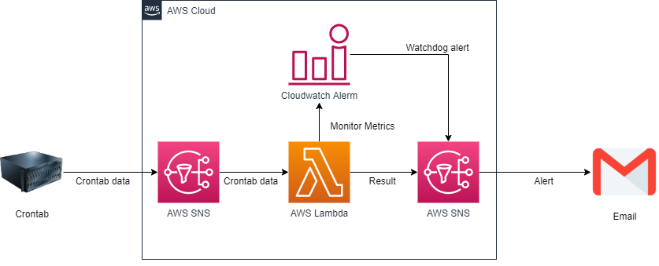

# crontab-aws-watchdog
monitor crontab by aws watchdog.

## Operating specifications

1. Crontab publishes crontab data to AWS SNS.
2. AWS Lambda analysis received crontab data and email result.
3. CloudWatchAlerm publish alert if Crontab or AWS lambda stop.



# Deploying
## Requirements
- AWS
  - AWS Account
  - Python 3.7 or greater
  - AWS CLI latest
- Linux
  - systemctl
  - aws-cli
  - jq

## Instructions by AWS console

1. Upload zipped lambda_function.py to S3 bucket
2. Edit crontab-aws-watchdog.yml
3. Create CloudFormation Stack by AWS console

### Upload zipped lambda_function.py to S3 bucket
1. Create S3 bucket by AWS console
2. You zip lambda_function.py
3. Upload lambda_function.zip to S3 bucket
4. Copy S3 URI of lambda_function.zip 


### Edit crontab-aws-watchdog.yml
1. Edit CodeUri in crontab-aws-watchdog.yml

```yaml
  JudgeResultLambda:
    Type: AWS::Serverless::Function
    Properties:
      FunctionName: judge_result
      Role: !GetAtt JudgeResultLambdaRole.Arn
      Runtime: python3.7
      Timeout: 300
      Handler: lambda_function.lambda_handler
      CodeUri: s3://crontab-aws-watchdog/lambda_function.zip 
```

### Create CloudFormation Stack by AWS console
1. Create CloudFormation Stack by AWS console

## Instructions by AWS CLI

### Create S3 bucket
### Package crontab-aws-watchdog.yml and Upload zipped lambda_function.py 
### Create CloudFormation Stack by AWS CLI

1. Create S3 bucket
2. Package crontab-aws-watchdog.yml and Upload zipped lambda_function.py 
3. Create CloudFormation Stack by AWS CLI


## Common Instructions
1. Create config.sh

### Create config.sh
1. Create config.sh like below
2. Edit AWS_SNS_TOPIC_ARN by SNS topic arn of HeartbeatNotification

```sh
#!/bin/bash -

readonly SERVICE_NAME="hello_world.service"
readonly AWS_SNS_TOPIC_ARN="arn:aws:sns:ap-northeast-1:123456789:HeartbeatNotification"
```